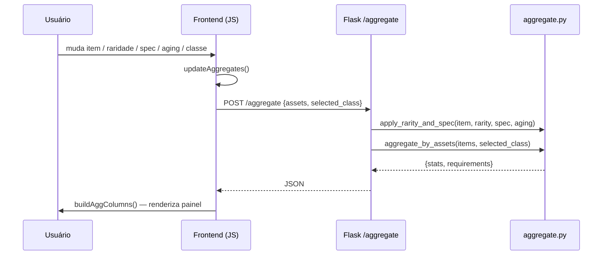
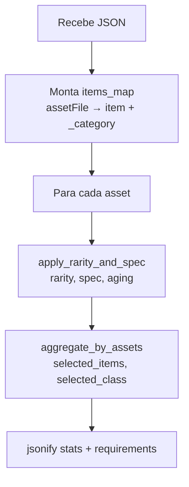
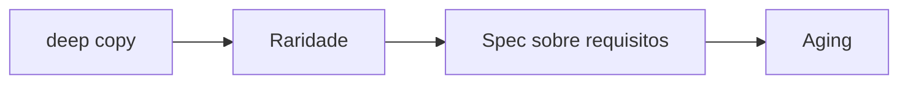
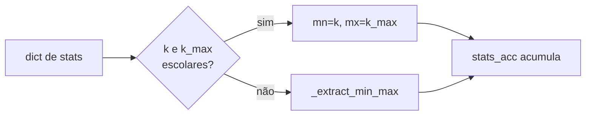

# Stats Finais dos Itens — Guia Ponta a Ponta

> Este documento descreve o sistema completo: do clique do usuário num combobox até o valor exibido no painel **Stats Finais dos Itens**.  
> Testes unitários: [`tests/test_aggregate.py`](../tests/test_aggregate.py)

---

## 1. Visão geral do fluxo



Cada mudança em qualquer controle de slot (item, raridade, spec, aging) **ou** na seleção de classe no painel Stats Finais dispara `updateAggregates()`.

---

## 2. Estrutura de dados — `items.json`

```json
{
  "id": "WS201",
  "_category": "espadas",
  "assets": { "assetFile": "assets/items/ws201.bmp" },
  "stats": {
    "attackPower": { "min": {"min": 100}, "max": {"min": 150} },
    "attackRating": 30,
    "attackRating_max": 40
  },
  "requirements": { "level": 60, "strength": 95, "agility": 30 },
  "spec": {
    "primaryClass": "Mechanician Fighter Pikeman",
    "bonuses": {
      "attackPower": { "min": {"min": 3}, "max": {"min": 3} },
      "attackRating": 1,
      "attackRating_max": 3
    }
  }
}
```

**Formatos de valor** (usados em `stats` e `spec.bonuses`):

| Formato | Exemplo | Resultado lido |
|---------|---------|----------------|
| Escalar | `95` | `(95, 95)` |
| Par escalar `k` + `k_max` | `attackRating:30, attackRating_max:40` | `(30, 40)` |
| Dict aninhado | `{min:{min:100}, max:{min:150}}` | `(100, 150)` |

A função `_extract_min_max` (`utils/aggregate.py:1`) normaliza todos esses formatos para `(mn, mx)`.

---

## 3. Etapa 1 — Interação do usuário e coleta no frontend

### 3.1 Controles por slot

Cada slot de equipamento contém (`templates/index.html`):

| Controle | ID DOM | Evento | Função chamada |
|----------|--------|--------|----------------|
| Combobox de item | `select-{i}` | `onchange` | `updateImage(i)` |
| Raridade | `rarity-{i}` | `onchange` | `changeRarity(i)` |
| Spec | `spec-{i}` | `onchange` | `changeSpec(i)` |
| Aging (Armadura/Escudo) | `aging-{i}` | `onchange` | `onAgingChange(i)` |

Todos esses handlers convergem para `renderAll(idx, item)` seguido de `updateAggregates()`.

### 3.2 Controle de classe global

O seletor `#sf-class` no painel **Stats Finais** chama `sfChangeClass()`, que agora também dispara `updateAggregates()`. Isso faz com que a mudança de classe reprocesse os bônus de todos os slots imediatamente.

### 3.3 Renderização local do slot

`renderAll(idx, item)` preenche três seções no painel do slot:

| Seção | Função | Fonte de dados |
|-------|--------|----------------|
| Stats | `renderStats(idx, item, rarity)` | `item.stats` + modificadores de raridade + aging |
| Requisitos | `renderReqs(idx, item, spec)` | `item.requirements` + modificadores de spec |
| Bonus | `renderBonus(idx, item)` | `item.spec.bonuses` — exibido sempre, sem modificadores |

> `renderBonus` exibe os valores brutos de `spec.bonuses`. A **inclusão** do bônus no cálculo agregado é decidida no backend, com base na classe selecionada.

### 3.4 Body do POST `/aggregate`

```js
{
  assets: [
    { asset: "assets/items/ws201.bmp", rarity: "epic", spec: "Fighter", aging: 0 },
    { asset: "assets/items/da102.bmp", rarity: "rare", spec: "",        aging: 3 }
  ],
  selected_class: "Fighter"   // valor atual de #sf-class; "" se nenhuma classe
}
```

---

## 4. Etapa 2 — Flask route `/aggregate` (`app.py:68`)



**Responsabilidades:**
- Lê `items.json` a cada requisição e anota `_category` em cada item.
- Chama `apply_rarity_and_spec` por item antes de agregar.
- Extrai `selected_class` do JSON e repassa para `aggregate_by_assets`.

---

## 5. Etapa 3 — `apply_rarity_and_spec` (`utils/aggregate.py:173`)

Retorna um **deep copy** do item com três camadas de modificadores aplicadas:



### 5.1 Raridade — bônus fixos somados aos stats

| Raridade | Arma `atkPower / atkRating` | Armadura/Roupão `defense / absorption` | Botas/Luvas `defense / absorption` | Escudo `absorption` | Bracelete `atkRating` | Orbital |
|----------|-----------------------------|----------------------------------------|-------------------------------------|---------------------|-----------------------|---------|
| normal | +0 / +0 | +0 / +0 | +0 / +0 | +0 | +0 | — |
| rare | +4 / +10 | +30 / +1 | +10 / +1 | +1 | +10 | — |
| epic | +8 / +20 | +60 / +2 | +20 / +2 | +2 | +20 | — |
| legendary | +12 / +30 | +90 / +3 | +30 / +3 | +3 | +30 | — |

Orbital não recebe bônus de raridade; recebe apenas bônus de aging.

### 5.2 Spec — modificadores percentuais nos requisitos

Fórmula: `low = ceil(req × (1 + pmin))`, `high = ceil(req × (1 + pmax))`.

> **Atenção — floating point:** `ceil(100 × 1.10)` = `ceil(110.000...01)` = **111**, não 110. Os testes usam os valores reais calculados pelo Python.

| Spec | strength | intelligence | talent | agility |
|------|----------|-------------|--------|---------|
| Mechanician | +5% / +10% | −20% / −10% | — | −25% / −15% |
| Fighter | +10% / +15% | −20% / −15% | — | −20% / −15% |
| Pikeman | +10% / +15% | −20% / −15% | — | −25% / −15% |
| Archer | −25% / −15% | −20% / −10% | — | +15% / +25% |
| Knight | +5% / +15% | −15% / −10% | +5% / +10% | −25% / −15% |
| Atalanta | −20% / −15% | −20% / −10% | — | +15% / +25% |
| Priestess | −25% / −20% | +15% / +20% | −15% / −10% | −20% / −15% |
| Mage | −25% / −20% | +15% / +25% | −15% / −10% | −20% / −15% |

`—` = spec não altera esse atributo (permanece escalar).

### 5.3 Aging — aplicado iterativamente por nível

| Categoria | `defense` | `absorption` | `block` |
|-----------|-----------|--------------|---------|
| Armadura / Roupão | `floor(v × 1.05)` por nível | +0.5/nível (1–9), +1.0/nível (10+) | — |
| Escudo | — | +0.2/nível (1–9), +0.4/nível (10+) | +0.5/nível, `floor` final |
| Orbital | `floor(v × 1.10)` por nível | +0.5/nível (1–9), +1.0/nível (10+) | — |

---

## 6. Etapa 4 — `aggregate_by_assets` (`utils/aggregate.py:61`)

Assinatura: `aggregate_by_assets(selected_items, selected_class=None)`

### 6.1 Stats — soma de todas as faixas

Para cada item, a função auxiliar `_accumulate_stat_dict` processa o dict de stats:



**Bônus por classe:** após acumular `item.stats`, se `selected_class` estiver em `item.spec.primaryClass`, o mesmo `_accumulate_stat_dict` é chamado com `item.spec.bonuses`. Com `selected_class=None` (nenhuma classe selecionada), nenhum bônus é adicionado — comportamento idêntico ao anterior.

### 6.2 Requisitos — máximo das faixas

```
req_final_min = max(min de cada item)
req_final_max = max(max de cada item)
```

### 6.3 Saída

- `min == max` → valor escalar.
- `min != max` → `[min, max]`.
- Chaves ausentes → `"-"`.

---

## 7. Etapa 5 — `buildAggColumns` (`templates/index.html`)

Recebe `{ stats, requirements }` e renderiza duas colunas no painel:

| Coluna | Ordem das chaves |
|--------|-----------------|
| Requisitos | `level → strength → intelligence → talent → agility` |
| Atributos | `defense → absorption → block → hp → stamina → mana → attackPower → attackRating → critical` |

Regra de exibição: `"-"` se ausente, `"X"` se escalar, `"X - Y"` se array.

---

## 8. Exemplo ponta a ponta

**Configuração:** Armadura DA102 (rare, Fighter, aging 3) com classe **Fighter** selecionada.

```
item.stats.defense         = {min:{min:8}, max:{min:12}}
item.stats.absorption      = 0.6
item.stats.absorption_max  = 0.9
item.spec.primaryClass     = "Mechanician Fighter Pikeman Archer Knight Atalanta"
item.spec.bonuses.defense  = {min:{min:5}, max:{min:10}}
item.spec.bonuses.absorption      = 0.1
item.spec.bonuses.absorption_max  = 0.2
```

**Passo a passo:**

| Etapa | defense (min–max) | absorption (min–max) |
|-------|-------------------|----------------------|
| Base | 8 – 12 | 0.6 – 0.9 |
| + rare rarity (+30 / +1) | 38 – 42 | 1.6 – 1.9 |
| + aging 3 (×1.05³ floor) | 43 – 48 | 3.1 – 3.4 |
| + bonus (Fighter match: +5–10 / +0.1–0.2) | 48 – 58 | 3.2 – 3.6 |

**Stats Finais dos Itens exibidos:** `defense: 48 - 58`, `absorption: 3.2 - 3.6`

---

## 9. Mapa de código

| Responsabilidade | Arquivo | Símbolo |
|-----------------|---------|---------|
| Coletar slots e disparar POST | `templates/index.html` | `updateAggregates` |
| Renderizar stats do slot | `templates/index.html` | `renderStats` |
| Renderizar requisitos do slot | `templates/index.html` | `renderReqs` |
| Renderizar bônus do slot | `templates/index.html` | `renderBonus` |
| Rota HTTP | `app.py` | `aggregate()` L68 |
| Rarity + spec + aging | `utils/aggregate.py` | `apply_rarity_and_spec` L173 |
| Normalizar formato de valor | `utils/aggregate.py` | `_extract_min_max` L1 |
| Acumular um dict de stats | `utils/aggregate.py` | `_accumulate_stat_dict` L61 |
| Somar stats / max reqs + bônus | `utils/aggregate.py` | `aggregate_by_assets` L83 |
| Renderizar painel agregado | `templates/index.html` | `buildAggColumns` |
